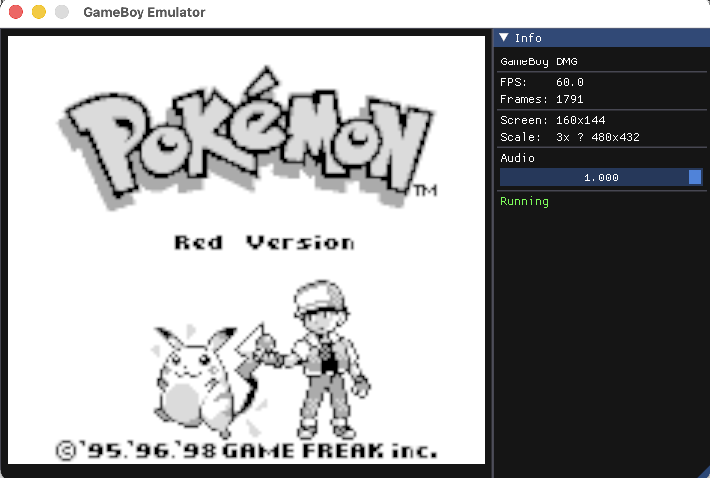
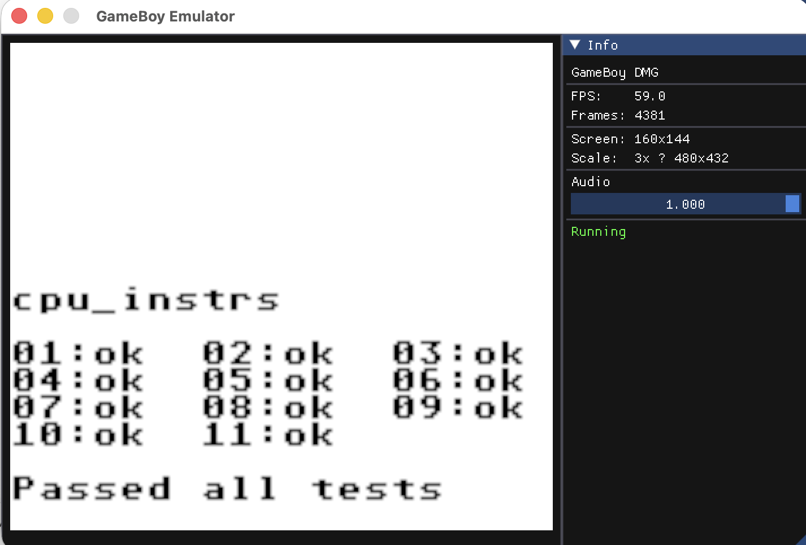

# GameBoy Emulator in Rust

A GameBoy (DMG-01) emulator written in Rust, implementing the SM83 CPU, memory management, PPU, APU, and all standard peripherals.




## Features

- **CPU**: SM83 (GBZ80-compatible) instruction set
- **Memory**: Full memory map including VRAM, WRAM, OAM, I/O registers, and MBC support
- **PPU**: LCD controller with mode tracking (OamScan, PixelTransfer, HBlank, VBlank)
- **APU**: 4-channel audio processor (pulse, wave, noise, stereo)
- **Timer**: DIV, TIMA, TMA, TAC registers
- **Interrupts**: V-Blank, LCDC STAT, Timer, Serial IO, Joypad

## Building

```bash
cargo build --release
```

## Binaries

### `lcd_display` — windowed display (recommended)

Runs a ROM in an interactive window with audio.

```bash
cargo run --bin lcd_display -- <rom_file>
```

### `gb_emu` — headless runner

Runs a ROM in a headless loop. Also supports disassembly and CPU testing.

```bash
cargo run --bin gb_emu -- [options] <rom_file>
```

**Note:** Options must come before `<rom_file>`.

## Command-Line Flags (`gb_emu` only)

| Flag | Description | Default |
|------|-------------|---------|
| `--cpu-log [file]` | Enable CPU instruction logging | `cpu_log.txt` |
| `--serial-log [file]` | Enable serial output logging | `serial_log.txt` |
| `--disasm` | Disassemble ROM from 0x0100 instead of running | — |
| `--cycle-limit <n>` | Stop after executing `n` cycles | — |
| `--cpu-json-test <dir>` | Run CPU tests from a GameboyCPUTests directory | — |
| `--help`, `-h` | Show help and exit | — |

## Examples

Run a ROM in the windowed display:

```bash
cargo run --bin lcd_display -- game.gb
```

Run headless:

```bash
cargo run --bin gb_emu -- game.gb
```

Run with CPU logging:

```bash
cargo run --bin gb_emu -- --cpu-log game.gb
```

Run with CPU and serial logging to custom files:

```bash
cargo run --bin gb_emu -- --cpu-log cpu.log --serial-log serial.log game.gb
```

Disassemble a ROM:

```bash
cargo run --bin gb_emu -- --disasm game.gb
```

Run CPU JSON tests:

```bash
cargo run --bin gb_emu -- --cpu-json-test path/to/GameboyCPUTests/
```

## CPU Instruction Log format (`--cpu-log`)

Each executed instruction is written as:

```
PC=$1234 A:$00 F:00 BC:$0013 DE:$00D8 HL:$014D SP:$FFFE CYCLES:4
```

## Memory Map

| Address Range | Size | Description |
|---------------|------|-------------|
| 0000-3FFF | 16 KiB | ROM Bank 0 |
| 4000-7FFF | 16 KiB | ROM Bank 1-NN (switchable via MBC) |
| 8000-9FFF | 8 KiB | Video RAM (VRAM) |
| A000-BFFF | 8 KiB | External RAM (from cartridge) |
| C000-CFFF | 4 KiB | Work RAM (WRAM) |
| D000-DFFF | 4 KiB | Work RAM (bankable on CGB) |
| E000-FDFF | 8 KiB | Echo RAM (mirror of C000-DDFF) |
| FE00-FE9F | 160 B | Object Attribute Memory (OAM) |
| FF00-FF7F | 128 B | I/O Registers |
| FF80-FFFE | 127 B | High RAM (HRAM) |
| FFFF | 1 B | Interrupt Enable (IE) |

## Project Structure

```
src/
├── audio/          # APU implementation
│   ├── apu.rs      # Audio processor
│   └── channels.rs # Audio channels
├── bin/
│   └── lcd_display.rs  # Windowed display (wgpu + Dear ImGui)
├── cpu/            # CPU implementation
│   ├── cpu.rs      # CPU struct and execution
│   ├── decode.rs   # Instruction decoding
│   ├── exec/       # Instruction execution
│   ├── instructions.rs
│   └── registers.rs
├── input/          # Input handling
│   └── joypad.rs
├── interrupt/      # Interrupt controller
├── memory/         # Memory management
│   ├── mbc.rs      # Memory Bank Controller
│   └── mmu.rs      # Memory Bus Unit
├── ppu/            # Picture Processing Unit
│   ├── oam.rs
│   ├── rendering.rs
│   └── video.rs
├── system.rs       # Main system controller
├── timer.rs        # Timer module
├── config.rs       # EmulatorFlags
├── disasm.rs       # SM83 disassembler
└── main.rs         # gb_emu binary entry point
```

## License

MIT
